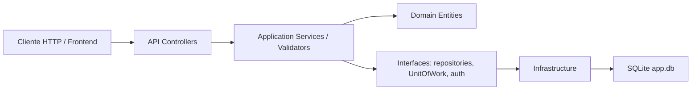
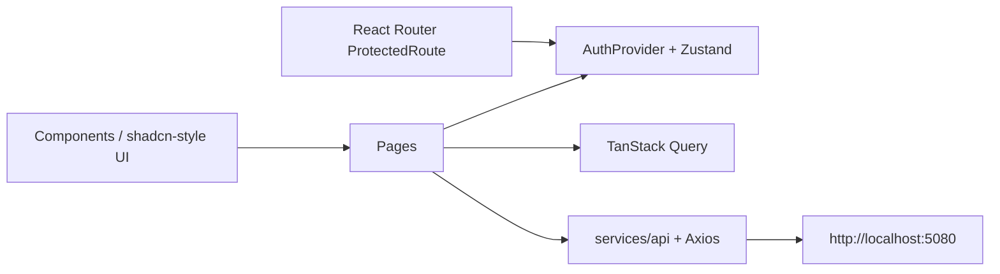

# Arquitectura

El monorepo separa backend y frontend en carpetas independientes, pero ambos trabajan sobre el mismo dominio: autenticacion, usuarios, paises y departamentos.

```text
proyecto/
  apps/
    api/   API .NET 8 + EF Core + SQLite
    web/   React 19 + TypeScript + Vite 6
  packages/
  docs/
```

## Backend

El backend sigue una estructura tipo Clean Architecture:



Capas:

- `apps/api/src/API`: configuracion de ASP.NET Core, Swagger, CORS, JWT Bearer, politicas y controladores.
- `apps/api/src/Application`: DTOs, comandos, validadores, servicios de casos de uso e interfaces.
- `apps/api/src/Domain`: entidades y reglas base del dominio.
- `apps/api/src/Infrastructure`: EF Core, `AppDbContext`, repositorios, UnitOfWork, Argon2id, token service y seed de datos.
- `apps/api/tests`: pruebas unitarias e integracion.

## Frontend

El frontend esta organizado por responsabilidad:



Partes principales:

- `apps/web/src/auth`: estado de sesion con AuthProvider y Zustand, login, logout, usuario actual, roles y helper `hasRole`.
- `apps/web/src/routes`: rutas privadas con React Router y control por rol.
- `apps/web/src/services/api`: cliente HTTP centralizado con Axios, endpoints y almacenamiento de tokens.
- `apps/web/src/pages`: pantallas de login, dashboard, paises, departamentos, usuarios y cuenta.
- `apps/web/src/types`: contratos TypeScript de la API.
- `apps/web/src/utils`: mapeo de roles y utilidades como `cn`.
- TanStack Query se usa para estado de servidor, Zod para validacion de formularios y Tailwind CSS 4 para utilidades de estilos.
- Playwright cubre smoke tests E2E del flujo de login con API mockeada.

## Flujo entre capas

1. El usuario interactua con una pantalla React.
2. La pantalla llama a un endpoint centralizado en `services/api`.
3. El cliente HTTP agrega el JWT si existe.
4. La API valida autenticacion y rol con politicas.
5. El controlador delega en servicios de `Application`.
6. `Application` usa repositorios/UnitOfWork de `Infrastructure`.
7. EF Core persiste en SQLite.
8. La respuesta vuelve al frontend y se muestra en la UI.

## Decisiones importantes

- La autorizacion fuerte vive en backend mediante politicas por rol.
- El frontend oculta rutas y navegacion segun roles para mejorar UX, pero no reemplaza la seguridad del backend.
- Argon2id vive solo en backend.
- SQLite se usa como base local del proyecto.
- Las pruebas de integracion del backend no dependen de la base local real.
