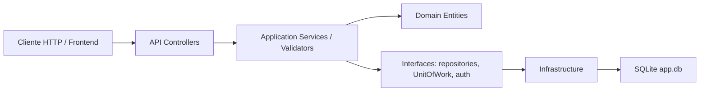
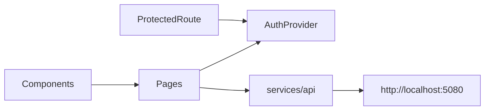

# Arquitectura

El monorepo separa backend y frontend en carpetas independientes, pero ambos trabajan sobre el mismo dominio: autenticación, usuarios, países y departamentos.

```text
proyecto/
  backend/   API .NET 8 + EF Core + SQLite
  frontend/  React + TypeScript + Vite
  docs/      Documentación técnica
```

## Backend

El backend sigue una estructura tipo Clean Architecture:



Capas:

- `API`: configuración de ASP.NET Core, Swagger, CORS, JWT Bearer, políticas y controladores.
- `Application`: DTOs, comandos, validadores, servicios de casos de uso e interfaces.
- `Domain`: entidades y reglas base del dominio.
- `Infrastructure`: EF Core, `AppDbContext`, repositorios, UnitOfWork, Argon2id, token service y seed de datos.
- `tests`: pruebas unitarias e integración.

## Frontend

El frontend está organizado por responsabilidad:



Partes principales:

- `auth`: estado de sesión, login, logout, usuario actual, roles y helper `hasRole`.
- `routes`: rutas privadas y control por rol.
- `services/api`: cliente HTTP centralizado, endpoints y almacenamiento de tokens.
- `pages`: pantallas de login, dashboard, países, departamentos, usuarios y cuenta.
- `types`: contratos TypeScript de la API.
- `utils`: mapeo de roles.

## Flujo entre capas

1. El usuario interactúa con una pantalla React.
2. La pantalla llama a un endpoint centralizado en `services/api`.
3. El cliente HTTP agrega el JWT si existe.
4. La API valida autenticación y rol con políticas.
5. El controlador delega en servicios de `Application`.
6. `Application` usa repositorios/UnitOfWork de `Infrastructure`.
7. EF Core persiste en SQLite.
8. La respuesta vuelve al frontend y se muestra en la UI.

## Decisiones importantes

- La autorización fuerte vive en backend mediante políticas por rol.
- El frontend oculta rutas y navegación según roles para mejorar UX, pero no reemplaza la seguridad del backend.
- Argon2id vive solo en backend.
- SQLite se usa como base local del proyecto.
- Las pruebas de integración del backend no dependen de la base local real.
