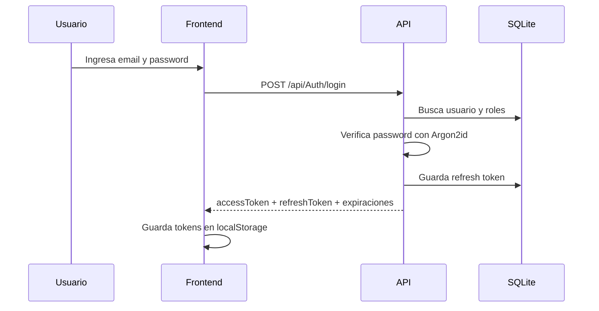
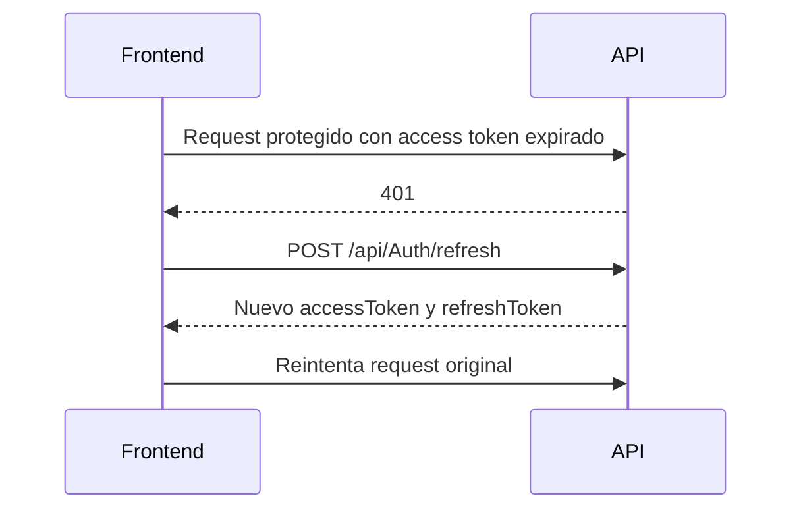

# Flujo de autenticación

El sistema usa access tokens JWT para autorizar requests y refresh tokens para renovar sesión.

## Login



Usuario inicial en desarrollo:

- Email: `admin@ejemplo.com`
- Password: `Admin123!`
- Roles: `COUNTRY`, `DEPARTMENT`, `USER_ADMIN`

## Requests protegidos

El frontend envía:

```http
Authorization: Bearer {accessToken}
```

El backend valida:

- Firma del token.
- Issuer.
- Audience.
- Expiración.
- Roles requeridos por política.

Políticas:

- `CountryAccess`: requiere `COUNTRY`.
- `DepartmentAccess`: requiere `DEPARTMENT`.
- `UserAdminAccess`: requiere `USER_ADMIN`.

## Refresh token



Si el refresh falla, el frontend limpia la sesión local y redirige al login.

## Logout

`POST /api/Auth/logout` requiere access token válido. El backend invalida el refresh token almacenado para el usuario autenticado. El frontend limpia `localStorage` aunque la sesión ya no pueda continuar.

## Cambio de contraseña

`POST /api/Auth/change-password` requiere access token válido y recibe:

```json
{
  "currentPassword": "PasswordActual",
  "newPassword": "NuevaPassword123!"
}
```

El backend verifica la contraseña actual y guarda el nuevo hash usando Argon2id.

## Responsabilidad del frontend

El frontend:

- Envía credenciales al backend.
- Guarda tokens localmente.
- Agrega el header Bearer.
- Renueva sesión con refresh token.
- Limpia sesión si refresh falla.
- Oculta navegación según roles.

El frontend no hashea contraseñas y no contiene secretos.
